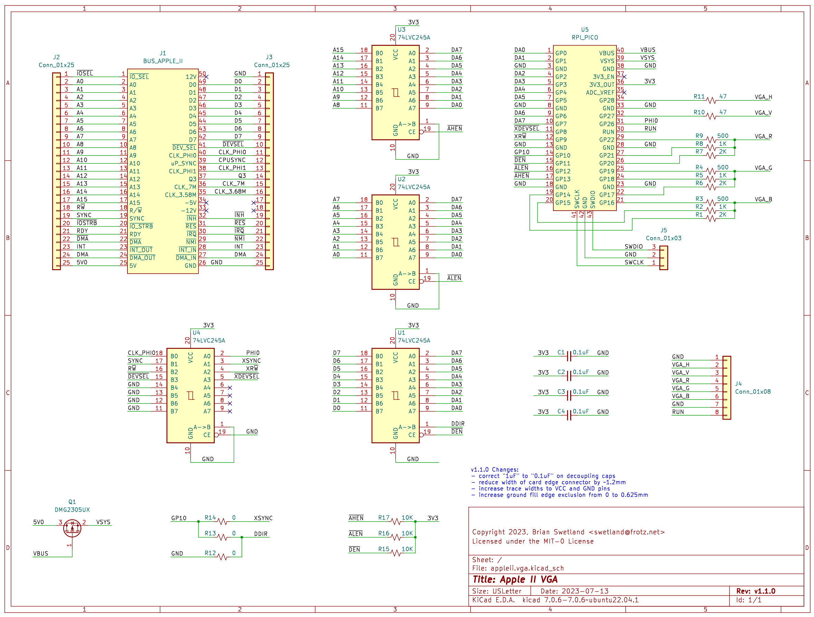

# Apple II VGA PCB

This is a pair of PCBs that implements a version of the Apple II VGA design.

Please see the [Apple II VGA Project](https://github.com/markadev/AppleII-VGA) for details and firmware.

This version differs from the original in that:
1. It makes use of the Rpi Pico's regulator for 3v3 supply
2. It allows the SYNC signal to be optionally routed to the Rpi Pico (instead of allowing Apple II bus read operations)
3. It uses a fourth 74LVC245A instead of a 74LS07 for the remaining bus signals (fewer unique components)

The KiCAD source files are included in the [appleii.vga/](appleii.vga/)
and [appleii.vga.connector/](appleii.vga.connector/) directories.

The [export/](export/) directory contains gerber files suitable for fabrication.
Beware that only the v1.0.2 version has been fabricated so far (at JLCPCB).
The v1.1.0 version contains some minor improvements but has not yet been
fabricated and tested.

To use the standard firmware, install a 0 ohm resistor at R13 and leave R12 and R14 unpopulated.

PCBs and parts for assembly:

Assembled PCBs:

Installed in an Apple IIe:

Lode Runner displayed on a 15" Sony Trinitron VGA monitor:

Schematic and Layout for v1.1.0:

